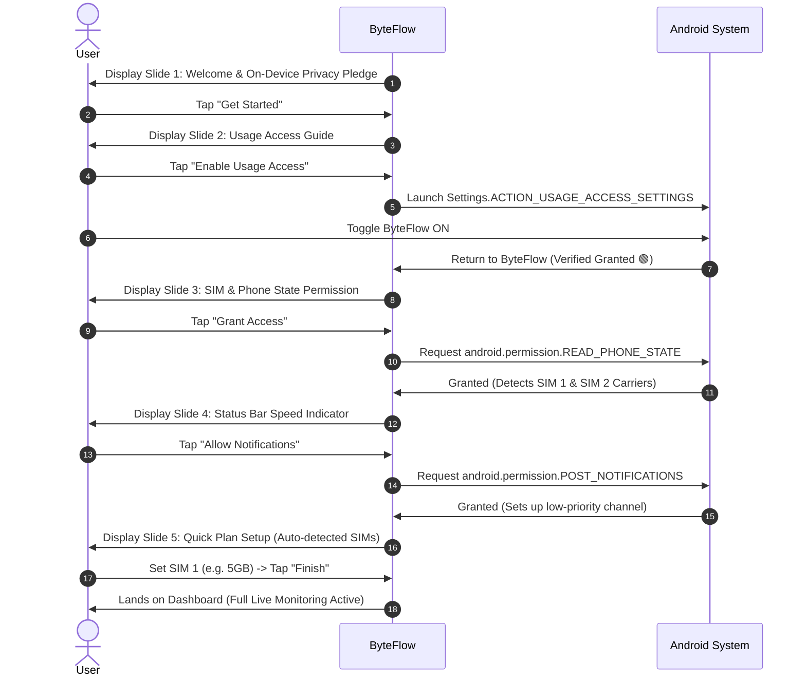

# ByteFlow — Full App Tree, Screen Hierarchy, Typography & Onboarding Specs

This document defines the complete screen hierarchy, nested sub-screens, onboarding flow, permission requirements, typography scale, full app tree architecture, and animation engine for **ByteFlow**.

---

## 1. Complete Screen & Sub-Screen Hierarchy

```
ByteFlow Application
│
├── [0] Onboarding & Initial Setup Flow (First Run Only)
│   ├── Slide 1: Welcome & 100% On-Device Privacy Pledge
│   ├── Slide 2: Usage Access Permission Guide (PACKAGE_USAGE_STATS)
│   ├── Slide 3: Phone State Permission (Carrier & SIM detection)
│   ├── Slide 4: Notifications Permission (Status bar live indicator)
│   └── Slide 5: Quick Initial Plan Setup (Auto-detected active carrier quota)
│
├── [1] Main Navigation Shell (Material 3 Bottom NavigationBar / NavigationRail)
│   │
│   ├── Tab 1: DashboardScreen (Home & Live Pulse)
│   │   ├── Active Carrier & Network Badge (Automatic Detection)
│   │   ├── Live Speed Card (Download/Upload Pulse)
│   │   ├── Plan Usage Gauge (Circular arc, days left, pace status)
│   │   ├── Today's Cellular vs Wi-Fi Card
│   │   └── Top 3 Apps Preview Card
│   │
│   ├── Tab 2: AppUsageScreen (Data Detective)
│   │   ├── Network Mode Filter: [All] [Mobile] [Wi-Fi]
│   │   ├── Time Range Selector: [Today] [Weekly] [Monthly] [Yearly]
│   │   ├── Search & Sort Bar
│   │   ├── Ranked App Usage List (Virtualized ListView, itemExtent: 76.0)
│   │   └── [Nested Modal] AppDetailsBottomSheet:
│   │       ├── App Icon, Name, Package ID, UID
│   │       ├── Dynamic Usage Timeline for this app
│   │       ├── Foreground vs Background Data Meter
│   │       ├── Launch Application button
│   │       └── Open Android System App Info button
│   │
│   ├── Tab 3: HistoryScreen (Spikes & Multi-Timeframe Analytics)
│   │   ├── Time Range Selector: [Today] [Weekly] [Monthly] [Yearly]
│   │   ├── Multi-Timeframe Charts:
│   │   │   ├── Today: 24-Hour Hourly Spike Bar Chart with Peak Flag
│   │   │   ├── Weekly: 7-Day Cellular vs Wi-Fi Comparative Bar Chart
│   │   │   ├── Monthly: 30-Day Cumulative Burn Line Chart vs Ideal Quota Pace
│   │   │   └── Yearly: 12-Month Annual Cellular vs Wi-Fi Distribution
│   │   ├── Spike Diagnostics Card (Peak time bucket & culprit app)
│   │   └── Metrics Grid: Daily Average, Projected Total, Wi-Fi Offload Ratio
│   │
│   └── Tab 4: PlanScreen (Data Plan & Quota Manager)
│       ├── Active Carrier Connection Card (Auto-detected, zero-friction)
│       ├── Plan Quota & Usage Progress Summary
│       └── [Nested Sheet] EditPlanModalSheet:
│           ├── Quota Input (GB/MB + Slider)
│           ├── Cycle Type Selector (Monthly / Daily / 28-Day Prepaid)
│           ├── Reset Day Selector (Day 1-31)
│           └── Warning Alert Threshold Slider (75% - 95%)
│
└── Secondary Screens (Accessed from Top App Bar):
    │
    └── SettingsScreen
        ├── Section 1: Status Bar & Notification Options
        │   ├── Live Speed Notification Toggle
        │   ├── Sampling Rate Selector (1.0s, 1.5s, 2.0s, 3.0s)
        │   └── Speed Units Picker (Bytes/s vs Bits/s)
        ├── Section 2: Battery Saver Diagnostics
        │   ├── Screen-Off Auto-Pause Status (`ACTION_SCREEN_OFF`)
        │   └── Wakelock Verification (Confirmed 0 wakelocks)
        ├── Section 3: Permission Health Center
        │   ├── Live status chips (Usage Access, Phone State, Notification)
        │   └── Direct system settings launch triggers
        ├── Section 4: Data Management & Backup
        │   ├── Export Data to CSV
        │   └── Clear Cached History
        └── Section 5: About & Privacy
            ├── 100% On-Device Privacy Pledge
            └── Version info & Open Source Licenses
```

---

## 2. Typography Scale (Material 3)

The app utilizes a modern, legible sans-serif type scale (system Roboto / Inter) optimized for tabular numbers and glanceable glance-reading:

| Scale Role | Font Weight | Size (sp) | Tracking | Primary Usage in ByteFlow |
| :--- | :--- | :--- | :--- | :--- |
| **DisplayLarge** | SemiBold (600) | 44sp | -0.25 | Hero live speed values (e.g. `2.45 MB/s`) |
| **HeadlineMedium**| Bold (700) | 28sp | 0 | Consumed plan amounts (e.g. `3.40 GB / 5.0 GB`) |
| **HeadlineSmall** | SemiBold (600) | 22sp | 0 | Card section titles, Screen headers |
| **TitleLarge** | Medium (500) | 20sp | 0 | Screen AppBar titles, App names in modal |
| **TitleMedium** | SemiBold (600) | 16sp | +0.15 | App labels (`YouTube`), Carrier badges |
| **BodyLarge** | Regular (400) | 16sp | +0.5 | Settings descriptions, Onboarding explanations |
| **BodyMedium** | Regular (400) | 14sp | +0.25 | App package IDs, Metric subtitles, Timestamps |
| **LabelLarge** | Medium (500) | 14sp | +0.1 | Buttons, Primary filter chips (`[Today]`, `[Mobile]`) |
| **LabelSmall** | Bold (700) | 11sp | +0.5 | Badges (`ACTIVE DATA`, `SIM 1`, `FOREGROUND`, `BG`) |

---

## 3. Onboarding & Permission Workflow



---

## 4. Full App Tree Architecture (Aligned with `flutter-apply-architecture-best-practices`)

```
lib/
├── l10n/                                  # Localization resources (flutter-setup-localization)
│   ├── app_en.arb
│   └── app_localizations.dart
├── core/                                  # Cross-cutting foundational modules
│   ├── errors/                            # AppFailure, Failure mappings
│   ├── functional/                        # Result<S, F> monad
│   ├── theme/                             # Material 3 tokens, dynamic Monet palette
│   └── utils/                             # ByteFormatter, DateUtils, PlatformUtils
├── domain/                                # Pure Dart domain layer (no Flutter dependencies)
│   ├── models/                            # Clean immutable entities
│   │   ├── time_range.dart                # TimeRange enum (today, week, month, year)
│   │   ├── usage_time_bucket.dart         # Discrete time bucket model
│   │   ├── historical_summary_entity.dart # Aggregated summary entity
│   │   ├── app_usage_entity.dart
│   │   ├── network_summary_entity.dart
│   │   ├── data_plan_entity.dart
│   │   └── sim_info_entity.dart
│   └── use_cases/                         # Interactors (reusable business logic)
│       ├── get_today_usage_use_case.dart
│       ├── get_historical_summary_use_case.dart
│       ├── get_app_breakdown_use_case.dart
│       └── get_hourly_spikes_use_case.dart
├── data/                                  # Data access & caching layer
│   ├── models/                            # Serialized DTOs (flutter-implement-json-serialization)
│   │   ├── app_usage_dto.dart
│   │   ├── network_summary_dto.dart
│   │   └── usage_time_bucket_dto.dart
│   ├── database/                          # SQLite DAOs (sqflite)
│   │   ├── app_database.dart
│   │   ├── daos/network_snapshots_dao.dart
│   │   ├── daos/daily_rollups_dao.dart
│   │   ├── daos/monthly_rollups_dao.dart
│   │   └── daos/app_usage_dao.dart
│   ├── repositories/                      # Repository implementations (Single Source of Truth)
│   │   ├── network_repository_impl.dart
│   │   └── plan_repository_impl.dart
│   └── services/                          # Stateless platform IPC & SQLite local storage
│       ├── native_network_service.dart
│       ├── cold_start_backfill_service.dart
│       └── local_database_service.dart
└── ui/                                    # Presentation layer (MVVM pattern)
    ├── core/                              # Shared presentation widgets & layout constraints
    │   ├── animations/                    # PulseIndicator, RadialGauge, CountUpText
    │   └── widgets/                       # MetricCard, AppUsageTile, TimeRangeSegmentedButton, CarrierBadge
    └── features/                          # Feature modules (ViewModel + View)
        ├── onboarding/
        │   ├── view_models/onboarding_view_model.dart
        │   └── views/onboarding_view.dart
        ├── dashboard/
        │   ├── view_models/dashboard_view_model.dart
        │   └── views/dashboard_view.dart
        ├── app_usage/
        │   ├── view_models/app_usage_view_model.dart
        │   └── views/app_usage_view.dart
        ├── history/
        │   ├── view_models/history_view_model.dart
        │   └── views/history_view.dart
        ├── plan/
        │   ├── view_models/plan_view_model.dart
        │   └── views/plan_view.dart
        └── settings/
            ├── view_models/settings_view_model.dart
            └── views/settings_view.dart
```

---

## 5. Production Package Selection (Zero-Bloat ADR)

Selected in strict accordance with [`docs/PACKAGE_SELECTION_AND_ECOSYSTEM.md`](file:///storage/emulated/0/AndroidPEProjects/ByteFlow/docs/PACKAGE_SELECTION_AND_ECOSYSTEM.md):

1. **`provider: ^6.1.5`**: Predictable, lightweight MVVM state management & DI. Zero code-gen, instant hot reload.
2. **`fl_chart: ^1.2.0`**: Vector Canvas charting for 24-hr hourly bars, 7-day comparative bars, and 30-day cumulative burn curves.
3. **`sqflite: ^2.4.2` & `path: ^1.9.1`**: C-level SQLite engine executing `SUM` and `GROUP BY` aggregations in <2ms for weekly/monthly/yearly rollups.
4. **`shared_preferences: ^2.5.4`**: Key-value storage for plan settings, SIM configurations, and user preferences.
5. **`intl: ^0.20.2`**: Locale-aware date math, calendar formatting, and number localization.
6. **`dynamic_color: ^1.9.0`**: Material You wallpaper Monet palette harmonization.
7. **Built-in `CustomPainter` & Native Channels**: Zero third-party bloat for live speed halos, radial gauges, and Linux socket queries.

---

## 6. Animation Strategy & Micro-Interactions

ByteFlow uses purposeful, performant 60/120 FPS animations without third-party heavy animation runtimes:

1. **Speed Pulse Glow (`PulseIndicator`)**:
   - A soft pulsating halo around the live speed badge driven by `AnimationController` with a repeating `Curves.easeInOut` curve.
   - Dynamically scales its pulse frequency: slow throb at low data transfer (e.g., 50 KB/s), energetic throb during heavy downloads (e.g., 10 MB/s).
2. **Smooth Number Ticker (`CountUpText`)**:
   - When switching timeframes (e.g., from Today to This Week), data numbers count up smoothly over 400ms (`Curves.easeOutCubic`) rather than snapping jarringly.
3. **Plan Usage Arc (`RadialGauge`)**:
   - Custom-painted arc gauge with a gradient sweep that animates from 0% to the current usage percentage with an elastic ease curve.
4. **Interactive Chart Tooltips**:
   - `fl_chart` touch callbacks highlight the tapped hour/day with a smooth frosted tooltip container.
5. **Fluid Modal Sheets**:
   - Standard Material 3 bottom sheets with drag-handle physics and smooth backdrop dismissals.
