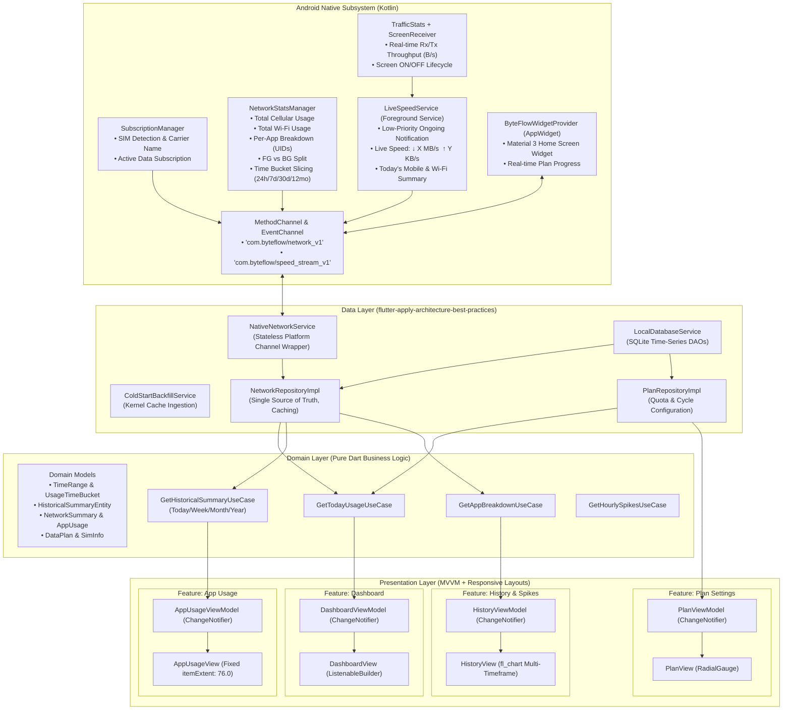
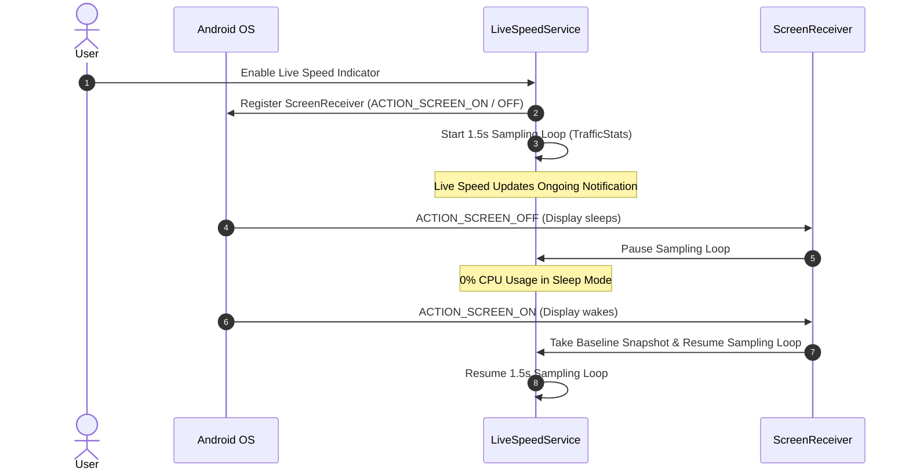

# ByteFlow — System Architecture & Design Specification

> **Governed by Official Flutter Agent Skills**:
> - [`flutter-apply-architecture-best-practices`](file:///storage/emulated/0/AndroidPEProjects/ByteFlow/.agents/skills/flutter-apply-architecture-best-practices/SKILL.md): MVVM Layered Architecture & Separation of Concerns.
> - [`flutter-build-responsive-layout`](file:///storage/emulated/0/AndroidPEProjects/ByteFlow/.agents/skills/flutter-build-responsive-layout/SKILL.md): Adaptive LayoutBuilder & Window Sizing.
> - [`flutter-hot-reload`](file:///storage/emulated/0/AndroidPEProjects/ByteFlow/.agents/rules/flutter-hot-reload.md): Stateful preservation during development.

---

## 1. Executive Summary & Core Tenets

**ByteFlow** is a lightweight, privacy-first Android application designed to track mobile data and Wi-Fi usage, support automatic active carrier detection, provide historical analytics with peak spike detection, display home screen widgets, and show a battery-optimized live speed indicator in the status bar.

### Core Tenets
1. **100% On-Device Privacy**: No analytics SDKs, no external telemetry, no remote servers. All network accounting data is read directly from Android's local kernel accounting tables (`NetworkStatsManager` and `TrafficStats`).
2. **Zero-Waste Battery Architecture**:
   - The live status bar speed indicator dynamically pauses sampling when the screen turns off (`ACTION_SCREEN_OFF`), ensuring 0% CPU consumption in sleep or pocket mode.
   - Long-term statistics rely on Android's indexed usage database rather than continuous background packet capture or wake locks.
3. **Automatic Carrier & SIM Detection (No Manual Switching)**:
   - Automatic carrier and SIM card detection via `SubscriptionManager`.
   - Automatically binds to the active data subscription (`SubscriptionManager.getDefaultDataSubscriptionId()`).
   - No manual SIM switching required; tracks active mobile connection seamlessly.
4. **Native Android Integration**:
   - Native Material 3 Home Screen AppWidget (`AppWidgetProvider`).
   - Ongoing low-priority status bar speed indicator notification with live throughput rates.
   - Deep links into system Usage Access and Notification settings.
5. **Zero-Static Data & Dynamic Multi-Timeframes**:
   - 100% dynamic kernel polling across **Today (Hourly 24h)**, **Weekly (7d)**, **Monthly (30d / cycle)**, and **Yearly (12mo)**.
   - Zero mock data; genuine cold-start backfill from Android's `/data/system/netstats/` logs.

---

## 2. High-Level Architecture Diagram (Official Flutter MVVM & Layering)

---

## 3. Privacy & Security Model

ByteFlow operates on a zero-trust external model:
- **No Remote Telemetry**: The app does not include any third-party advertising or analytics SDKs (e.g. Firebase, Mixpanel, Adjust).
- **No Network Egress**: The application does not send device usage, package lists, or telemetry outside the local device.
- **Local Persistence Only**: Settings, user quotas, and cached calculations are stored solely in Android's private app sandbox (`SQLite` / `SharedPreferences`).
- **System Permission Transparency**:
  - `PACKAGE_USAGE_STATS`: Declared with explicit onboarding rationale and opened via `Settings.ACTION_USAGE_ACCESS_SETTINGS`.
  - `READ_PHONE_STATE`: Used strictly for reading SIM card subscription metadata via `SubscriptionManager`.
  - `POST_NOTIFICATIONS`: Requested strictly on Android 13+ for the status bar live speed service.

---

## 4. Battery Optimization Strategy

Continuous background monitoring can easily drain device batteries if implemented naively. ByteFlow uses three key architectural measures:

1. **Screen-Aware Live Service**:
   - `LiveSpeedService` listens for `Intent.ACTION_SCREEN_OFF`. When the user locks the phone or puts it in a pocket, the timer loop is suspended immediately.
   - When `Intent.ACTION_SCREEN_ON` is received, the service captures a fresh baseline reading and resumes the timer loop.
2. **Kernel Accounting Reuse**:
   - Rather than intercepting packets with a local VPN (which keeps the CPU active and increases battery drain), ByteFlow reads historical statistics directly from Android's hardware accounting engine (`NetworkStatsManager`).
3. **Smart Home Screen Widget Updates**:
   - The home screen widget is updated on-demand when the app is opened, when data refreshes, or periodically via standard `AppWidgetProvider` update intervals (never keeping persistent wakelocks).
