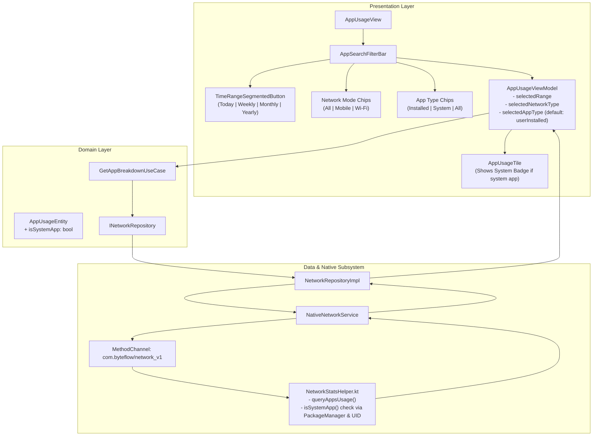

# Implementation Plan: App Data Usage Screen Filters (Timeframe, Network Mode, App Type)

## Goal Description
Enhance the **App Data Usage** screen in ByteFlow by providing three intuitive, multi-dimensional filters:
1. **Time Range Filter**: Seamless switching between **Today**, **Weekly**, **Monthly**, and **Yearly** network accounting.
2. **Network Mode Filter**: Filter telemetry by **All Networks**, **Mobile Cellular Data**, or **Wi-Fi**.
3. **App Type Filter**: Separate **User Installed Apps** from **System Apps**, defaulting to **User Installed Apps** so OS background processes do not clutter the user's primary view.

---

## User Review Required

> [!IMPORTANT]
> **Default Filter States**:
> - **Time Range**: `Today` (resolves bounds from midnight today to current timestamp).
> - **Network Mode**: `All` (with one-tap switching to `Mobile` cellular or `Wi-Fi`).
> - **App Type**: `User Installed` (by default, system apps like kernel, system UI, play services, and OEM daemons are filtered out; switching to `System` or `All` instantly reveals them).

> [!NOTE]
> **Zero Re-query Latency for App Type**:
> Network statistics are queried per-UID from Android's hardware `NetworkStatsManager`. App Type filtering (User Installed vs. System) is performed in-memory on the loaded dataset, ensuring instantaneous UI switching without reloading or IPC overhead.

---

## Architecture & Data Flow



---

## Proposed Changes

### 1. Android Native Subsystem

#### [MODIFY] `android/app/src/main/kotlin/com/byteflow/model/AppUsageRecord.kt`
- Add `val isSystemApp: Boolean = false` property.
- Include `"isSystemApp" to isSystemApp` in `toMap()`.

```kotlin
data class AppUsageRecord(
    val uid: Int,
    val packageName: String,
    val appName: String,
    var rxBytes: Long = 0L,
    var txBytes: Long = 0L,
    var foregroundRx: Long = 0L,
    var foregroundTx: Long = 0L,
    var backgroundRx: Long = 0L,
    var backgroundTx: Long = 0L,
    var appIconBase64: String? = null,
    val isSystemApp: Boolean = false
) {
    fun toMap(): Map<String, Any?> {
        return mapOf(
            "uid" to uid,
            "packageName" to packageName,
            "appName" to appName,
            "rxBytes" to rxBytes,
            "txBytes" to txBytes,
            "totalBytes" to totalBytes,
            "foregroundRx" to foregroundRx,
            "foregroundTx" to foregroundTx,
            "foregroundBytes" to foregroundBytes,
            "backgroundRx" to backgroundRx,
            "backgroundTx" to backgroundTx,
            "backgroundBytes" to backgroundBytes,
            "appIconBase64" to appIconBase64,
            "isSystemApp" to isSystemApp
        )
    }
}
```

#### [MODIFY] `android/app/src/main/kotlin/com/byteflow/network/NetworkStatsHelper.kt`
- Implement `isSystemApp(pm: PackageManager, packageName: String, uid: Int): Boolean`:
  1. If `uid < 10000` (e.g. UID 0 for kernel, UID 1000 for system, tethering, etc.), mark as system.
  2. If `packageName` starts with `"android."`, `"uid_"`, or is `"android"`, mark as system.
  3. Query `PackageManager.getApplicationInfo(packageName, 0)`: check `(flags & ApplicationInfo.FLAG_SYSTEM) != 0` or `(flags & ApplicationInfo.FLAG_UPDATED_SYSTEM_APP) != 0`.
- Populate `isSystemApp` when creating `AppUsageRecord` in `queryAppsUsage()`.

---

### 2. Flutter Domain Layer

#### [MODIFY] `lib/domain/models/app_usage_entity.dart`
- Add `final bool isSystemApp;` field with default `false`.
- Update `operator ==`, `hashCode`, and `toString()`.

#### [NEW] `lib/domain/models/app_type_filter.dart`
- Define enum for user vs system app filtering:
```dart
enum AppTypeFilter {
  userInstalled,
  system,
  all;

  String get displayName => switch (this) {
        AppTypeFilter.userInstalled => 'Installed',
        AppTypeFilter.system => 'System',
        AppTypeFilter.all => 'All',
      };
}
```

---

### 3. Flutter Data Layer

#### [MODIFY] `lib/data/models/app_usage_dto.dart`
- Add `final bool isSystemApp;` field with default `false`.
- In `fromMap`:
  ```dart
  isSystemApp: (map['isSystemApp'] as bool?) ?? (((map['uid'] as num?)?.toInt() ?? 0) < 10000),
  ```
- In `toMap`:
  `'isSystemApp': isSystemApp,`
- In `toEntity` and `fromEntity`: map `isSystemApp`.

---

### 4. Presentation Layer

#### [MODIFY] `lib/ui/features/app_usage/view_models/app_usage_view_model.dart`
- Add `AppTypeFilter _selectedAppType = AppTypeFilter.userInstalled;`.
- Expose getter `AppTypeFilter get selectedAppType => _selectedAppType;`.
- Add method `void setAppType(AppTypeFilter type)`:
  - If `_selectedAppType != type`, update, run `_applyFilter()`, and `notifyListeners()`.
- Update `_applyFilter()`:
  - Filter by `_selectedAppType`:
    - `AppTypeFilter.userInstalled`: keep `!app.isSystemApp`.
    - `AppTypeFilter.system`: keep `app.isSystemApp`.
    - `AppTypeFilter.all`: keep all apps.
  - Filter by `_searchQuery` (appName or packageName contains query).
  - Update `_filteredApps`.
- Update `loadApps()`:
  - Preserves selected `range` (`today`, `week`, `month`, `year`) and `networkType` (`all`, `mobile`, `wifi`).
  - Calls `_applyFilter()` upon receiving fresh data.

#### [MODIFY] `lib/ui/features/app_usage/widgets/app_search_filter_bar.dart`
- Accept `selectedAppType` and `onAppTypeChanged`.
- Structure into clean, compact controls:
  1. Search `TextField`.
  2. `TimeRangeSegmentedButton` (Today | Weekly | Monthly | Yearly).
  3. Filter chips section with two compact rows:
     - **Network Mode**: All | Mobile | Wi-Fi (with relevant icons).
     - **App Type**: Installed (default) | System | All (with relevant icons).

#### [MODIFY] `lib/ui/features/app_usage/views/app_usage_view.dart`
- Connect `selectedAppType` and `setAppType` from `AppUsageViewModel` to `AppSearchFilterBar`.
- Update summary banner text to reflect active filters (e.g. `Total: 1.4 GB across 18 installed apps`).

#### [MODIFY] `lib/ui/features/app_usage/widgets/app_usage_tile.dart`
- If an app is a system app (`app.isSystemApp`), display a small, elegant "System" badge next to the package name when viewed under System or All filters.

#### [MODIFY] `lib/ui/features/app_usage/widgets/app_details_bottom_sheet.dart`
- Display "App Type: User Installed" or "App Type: System Application" in the telemetry details sheet.

---

## Verification Plan

### Automated Tests
1. **DTO Serialization Unit Test** (`test/unit/data/app_usage_dto_test.dart`):
   - Verify `isSystemApp` correctly roundtrips via `fromMap`, `toMap`, `toEntity`, and `fromEntity`.
2. **ViewModel Unit Test** (`test/unit/ui/app_usage_view_model_test.dart` [NEW]):
   - Test initial state: `TimeRange.today`, `ChannelConstants.networkTypeAll`, `AppTypeFilter.userInstalled`.
   - Test that default filter shows only user-installed apps and filters out system apps.
   - Test switching `setAppType(AppTypeFilter.system)` and `setAppType(AppTypeFilter.all)`.
   - Test switching `setTimeRange` for today, weekly, monthly, yearly.
   - Test switching `setNetworkType` for all, mobile, wifi.
   - Test combined search query + app type filter.
3. **Widget Tests** (`test/widget/features/app_usage_view_test.dart`):
   - Verify rendering of time range switcher (Today, Weekly, Monthly, Yearly).
   - Verify rendering and tap interaction of network mode chips (All, Mobile, Wi-Fi).
   - Verify rendering and tap interaction of app type chips (Installed, System, All).
   - Verify that switching from Installed to System or All updates the rendered app list accordingly.
4. **Full Test Suite Execution**:
   - Run `flutter test` across all 114+ tests to ensure zero regressions.

### Manual Verification
1. Open the App Data Usage screen.
2. Verify that by default, only user-installed apps are displayed (system processes like Android OS / Kernel are hidden).
3. Tap "System" chip: verify system applications and background UIDs appear.
4. Tap "All" chip: verify both user and system applications appear together.
5. Tap "Mobile": verify data consumption is filtered to mobile cellular traffic only.
6. Tap "Wi-Fi": verify data consumption is filtered to Wi-Fi traffic only.
7. Tap "Weekly", "Monthly", "Yearly": verify time bounds update and aggregated stats load correctly.
8. Tap any app tile: verify detailed bottom sheet displays correct telemetry and app type badge.
