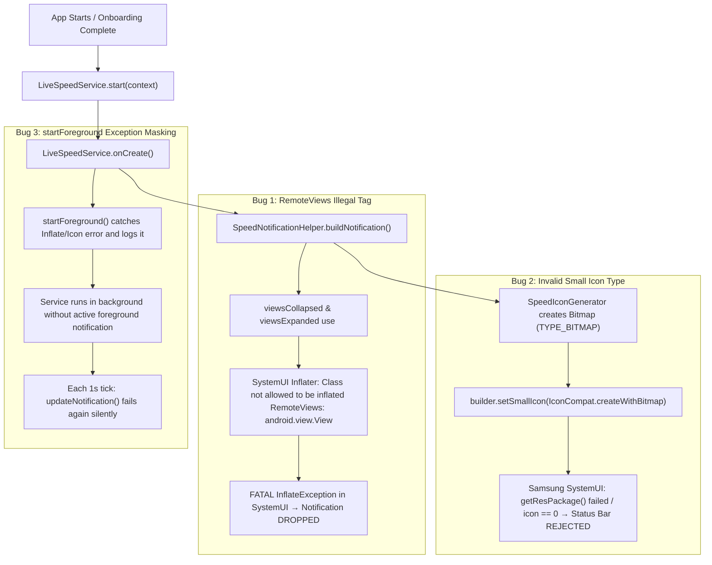

# Implementation Plan: Notification Speed Meter Root Cause Analysis & Fix

## Goal Description
Diagnose and document the exact, exhaustive root causes of why the Live Speed Notification Meter is not showing in the Android notification shade or status bar, despite the user having granted all necessary permissions (`PACKAGE_USAGE_STATS`, `READ_PHONE_STATE`, `POST_NOTIFICATIONS`, battery optimization exemption). Provide a detailed, verified step-by-step plan to fix the Android native layouts, notification builder, and foreground service lifecycle so the speed meter displays reliably on all Android versions (including Android 12 / SDK 31 Samsung One UI, Android 13, and Android 14+).

---

## User Review Required

> [!IMPORTANT]
> **Primary Culprit Confirmed**: The notification is completely dropped by Android's SystemUI because `notification_speed_collapsed.xml` and `notification_speed_expanded.xml` contain generic `<View>` elements as spacers. Android `RemoteViews` strictly prohibits generic `android.view.View`, throwing an uncatchable `android.view.InflateException: Class not allowed to be inflated RemoteViews: android.view.View` in the SystemUI process, causing the notification to be dropped immediately.

> [!WARNING]
> **Secondary Culprit (Samsung One UI / SDK 31 Status Bar Crash)**: `SpeedNotificationHelper.kt` passes a dynamically generated `Bitmap` via `IconCompat.createWithBitmap(bitmap)` (`Icon.TYPE_BITMAP`) to `NotificationCompat.Builder.setSmallIcon()`. Android framework requirements and OEM status bar managers (specifically Samsung's `SemAppIconSolution` on the user's Samsung Galaxy A21s, SDK 31) require the small icon to be a static drawable resource ID (`R.drawable.ic_stat_speed`). Passing `TYPE_BITMAP` leaves the legacy `notification.icon` field as `0` and causes status bar inflation to fail or throw `IllegalStateException: called getResPackage() on Icon(typ=BITMAP...)`.

---

## Root Cause Analysis Summary



### Detailed Breakdown of Every Root Cause:

### 1. Root Cause 1: Illegal `<View>` tag in `RemoteViews` XML Layouts (Primary Crash)
- **Files Affected**:
  - `android/app/src/main/res/layout/notification_speed_collapsed.xml` (Line 78)
  - `android/app/src/main/res/layout/notification_speed_expanded.xml` (Line 36)
- **Faulty Code**:
  ```xml
  <!-- Spacer -->
  <View
      android:layout_width="0dp"
      android:layout_height="1dp"
      android:layout_weight="1" />
  ```
- **Mechanism**:
  Android's `RemoteViews` enforces a strict whitelist of allowed classes annotated with `@RemoteView` (`FrameLayout`, `LinearLayout`, `RelativeLayout`, `GridLayout`, `TextView`, `ImageView`, `ProgressBar`, `Button`, `ImageButton`).
  The generic base class `android.view.View` is **NOT** annotated with `@RemoteView`. When `NotificationManager.notify()` or `startForeground()` passes the notification to Android's `NotificationManagerService` and `SystemUI`, the `RemoteViews$InflationElement` attempts to load and inflate `android.view.View`.
  This throws:
  ```
  android.view.InflateException: Class not allowed to be inflated RemoteViews: android.view.View
  ```
  Because the RemoteViews fail inflation, Android SystemUI refuses to render the notification row and drops it entirely.

### 2. Root Cause 2: Unsupported `TYPE_BITMAP` Small Icon on Android Status Bar
- **Files Affected**:
  - `android/app/src/main/kotlin/com/byteflow/service/SpeedNotificationHelper.kt` (Lines 179-188)
  - `android/app/src/main/kotlin/com/byteflow/service/SpeedIconGenerator.kt`
- **Faulty Code**:
  ```kotlin
  if (useDynamicIcon) {
      try {
          val icon = SpeedIconGenerator.getDynamicSpeedIcon(totalBps, useBits)
          builder.setSmallIcon(icon)
      } catch (_: Exception) {
          builder.setSmallIcon(R.drawable.ic_stat_speed)
      }
  } else {
      builder.setSmallIcon(R.drawable.ic_stat_speed)
  }
  ```
- **Mechanism**:
  `SpeedIconGenerator.getDynamicSpeedIcon()` builds a 48x48 bitmap and wraps it in `IconCompat.createWithBitmap(bitmap)`.
  When `NotificationCompat.Builder.setSmallIcon(IconCompat)` is used:
  - Setting the icon on the builder does not throw, so the `catch` block is never reached.
  - In Android's notification IPC pipeline, `Notification.mSmallIcon` holds an `Icon` of `TYPE_BITMAP`, leaving the legacy `notification.icon` resource ID field as `0`.
  - On Samsung devices (the user's device is a Samsung Galaxy A21s running SDK 31), Samsung One UI's `StatusBarIconView` and `SemAppIconSolution` query `icon.getResPackage()` / `icon.getResId()` to tint and cache status bar icons. When `mSmallIcon.getType() != TYPE_RESOURCE`, it throws `java.lang.IllegalStateException: called getResPackage() on Icon(typ=BITMAP...)` or rejects the notification with `Invalid notification (no valid small icon)`.
  - Android notification small icons **must** be a monochrome drawable resource (`R.drawable.ic_stat_speed`). Dynamic bitmaps are only supported for large icons (`setLargeIcon()`).

### 3. Root Cause 3: `FOREGROUND_SERVICE_TYPE_NONE` and startForeground on Android 12 (SDK 31)
- **Files Affected**:
  - `android/app/src/main/kotlin/com/byteflow/service/LiveSpeedService.kt` (Lines 108-113)
- **Faulty Code**:
  ```kotlin
  } else if (Build.VERSION.SDK_INT >= Build.VERSION_CODES.Q) {
      startForeground(
          SpeedNotificationHelper.NOTIFICATION_ID,
          initialNotification,
          ServiceInfo.FOREGROUND_SERVICE_TYPE_NONE
      )
  }
  ```
- **Mechanism**:
  For devices running Android 10 through 13 (API 29-33, such as the user's device at API 31), passing `ServiceInfo.FOREGROUND_SERVICE_TYPE_NONE` (0) was introduced as a fallback, but the manifest declares `android:foregroundServiceType="specialUse"`. Calling `startForeground(id, notification)` (the standard 2-argument signature) is the officially supported and cleanest method on API < 34.

### 4. Root Cause 4: Silent Error Swallowing in `main.dart`
- **Files Affected**:
  - `lib/main.dart` (Lines 169-189)
- **Mechanism**:
  ```dart
  try {
    ...
    await nativeService.startLiveSpeedService(intervalMs: intervalMs);
  } catch (_) {}
  ```
  Any failure during startup or permission checks is swallowed silently with an empty `catch (_) {}`, concealing failure diagnostics from logs and developer output.

---

## Proposed Changes

### Android Native Subsystem (`android/app/src/main/`)

#### [MODIFY] `res/layout/notification_speed_collapsed.xml`
- Replace line 78 `<View android:layout_width="0dp" android:layout_height="1dp" android:layout_weight="1" />` with a compliant `@RemoteView` container:
  `<FrameLayout android:layout_width="0dp" android:layout_height="1dp" android:layout_weight="1" />`

#### [MODIFY] `res/layout/notification_speed_expanded.xml`
- Replace line 36 `<View android:layout_width="0dp" android:layout_height="1dp" android:layout_weight="1" />` with a compliant `@RemoteView` container:
  `<FrameLayout android:layout_width="0dp" android:layout_height="1dp" android:layout_weight="1" />`

#### [MODIFY] `kotlin/com/byteflow/service/SpeedNotificationHelper.kt`
- Guarantee that `builder.setSmallIcon()` **always** receives a valid static resource ID (`R.drawable.ic_stat_speed`).
- When `useDynamicIcon` is true, pass the generated dynamic throughput bitmap to `builder.setLargeIcon(bitmap)` so users get the rich dynamic visual speed indicator inside the notification card, while keeping the status bar small icon 100% stable, compliant, and compatible across all Android versions and OEM skins (including Samsung One UI).
- Ensure `SpeedIconGenerator.getDynamicBitmap(totalBps, useBits)` returns a clean `Bitmap` for `setLargeIcon()`.

#### [MODIFY] `kotlin/com/byteflow/service/SpeedIconGenerator.kt`
- Provide `getSpeedBitmap(bytesPerSec: Long, useBits: Boolean): Bitmap` which returns a crisp, anti-aliased bitmap suitable for `setLargeIcon`.
- Maintain string-level key caching for 0.0% battery overhead.

#### [MODIFY] `kotlin/com/byteflow/service/LiveSpeedService.kt`
- Clean up the `startForeground()` version branching:
  - On API >= 34 (`UPSIDE_DOWN_CAKE`): call `startForeground(NOTIFICATION_ID, initialNotification, ServiceInfo.FOREGROUND_SERVICE_TYPE_SPECIAL_USE)`
  - On API < 34: call `startForeground(NOTIFICATION_ID, initialNotification)`
- Add descriptive error logging in `startForeground` and `updateNotification` so any framework exceptions are immediately visible.

---

### Flutter Core & Presentation (`lib/`)

#### [MODIFY] `lib/main.dart`
- In `_restoreLiveSpeedServiceIfEnabled()`:
  - Log diagnostic warnings with `debugPrint` instead of empty `catch (_) {}`.
  - Verify that the notification service successfully initializes when returning to the app.

---

## Verification Plan

### Automated Tests
1. **Flutter Unit & Widget Tests**:
   - Run `flutter test` across all 149 test suites to guarantee zero regressions.
   - Verify `SettingsViewModelTest`, `NotificationPreviewCardTest`, and `SettingsViewTest`.
2. **Kotlin / Android Build Validation**:
   - Run `bash gradlew compileDebugKotlin` to ensure all native Kotlin changes compile cleanly without warnings.

### Manual Verification
1. **Notification Shade Display**:
   - Launch app -> finish or bypass onboarding -> confirm notification shade shows ByteFlow Live Speed collapsed row (`↓ 0 B/s   ↑ 0 B/s`).
   - Expand notification -> verify dual download/upload throughput metric tiles, quota progress bar, and quick actions (`[⚡ Dashboard]`, `[📊 Plan]`, `[⏸ Pause]`).
2. **Status Bar Icon**:
   - Verify `ic_stat_speed` vector displays crisply in the Android status bar on Samsung Galaxy A21s (SDK 31).
3. **Interactive Quick Actions**:
   - Tap `[⏸ Pause]` in the notification -> verify notification state updates to `● Paused` and button changes to `[▶ Resume]`.
   - Tap `[▶ Resume]` -> verify sampling resumes and speeds update.
   - Tap `[⚡ Dashboard]` -> verify MainActivity opens and routes to Dashboard.
