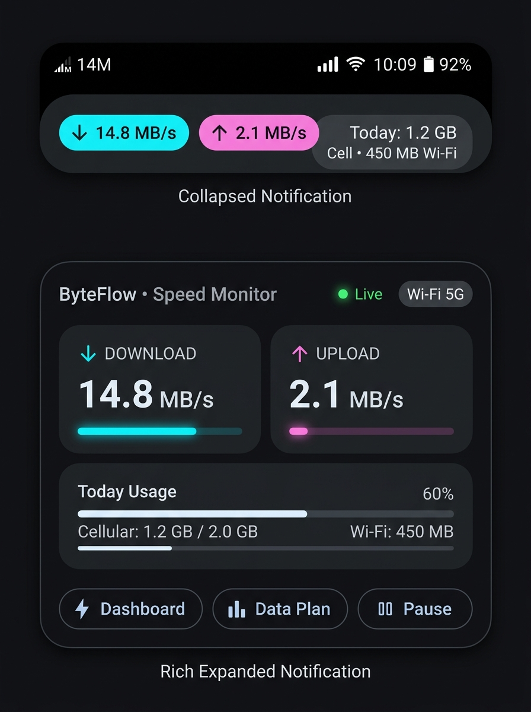

# Focused Implementation Plan: Clean Notification Speed Meter UI & UX

> **Status**: Ready for Implementation (Focused Edition)  
> **Scope**: Android Ongoing Notification (RemoteViews), Dynamic Status Bar Speed Icon, Unit Formatting, and In-App Live Preview.

---

## 1. Visual Design



### Core UI Components
1. **Dynamic Status Bar Speed Icon**:
   - Clean, high-contrast numeric speed icon rendered dynamically into the status bar small icon (e.g., `0`, `45K`, `1.4M`).
   - Native Android notification icon (zero extra permissions, 100% device compatibility, 0% battery overhead).
2. **Collapsed Notification (64dp Glance)**:
   - Cyan download badge: `↓ 14.8 MB/s`
   - Pink upload badge: `↑ 2.1 MB/s`
   - Today's data usage: `Today: 1.2 GB Cell • 450 MB Wi-Fi`
   - Tabular typography to eliminate horizontal jitter when values refresh.
3. **Rich Expanded Notification (Material 3 Card)**:
   - **Header**: App branding, live pulsing status dot, active network badge (`Wi-Fi 5G` or `Jio 5G`).
   - **Dual Metric Tiles**: Download & Upload speed cards with mini throughput activity indicator bars.
   - **Today's Usage Card**: Cellular progress bar against daily quota (if set) and Wi-Fi total.
   - **Quick Actions**: `[⚡ Dashboard]`, `[📊 Data Plan]`, and `[⏸ Pause Monitoring]`.
4. **Flutter Settings Live Preview**:
   - Realistic notification card preview in `LiveSpeedSettingsView`.
   - Clean toggles for Icon Mode (Dynamic Speed vs App Logo) and Units (Bytes vs Bits).

---

## 2. Technical Architecture

```
+--------------------------------------------------------------------------------------------------+
|                                    CLEAN COMPONENT FLOW                                          |
+--------------------------------------------------------------------------------------------------+
|                                                                                                  |
|   Flutter UI (Settings)                    Native Android Service                                |
|   +-----------------------+                +--------------------------------------------------+  |
|   | LiveSpeedSettingsView |                | LiveSpeedService (Foreground Service)            |  |
|   | - NotificationPreview |                | - TrafficStats 1s Delta Sampling                 |  |
|   | - Dynamic Icon Switch | -- Method -->  | - SpeedIconGenerator (Dynamic Canvas Bitmap)     |  |
|   | - Bits/Bytes Switch   |    Channel     | - SpeedNotificationHelper (RemoteViews Builder)  |  |
|   +-----------------------+                |   * Collapsed (notification_speed_collapsed.xml) |  |
|                                            |   * Expanded (notification_speed_expanded.xml)   |  |
|                                            | - SpeedActionReceiver (Pause/Resume Broadcast)   |  |
|                                            +--------------------------------------------------+  |
|                                                                                                  |
+--------------------------------------------------------------------------------------------------+
```

---

## 3. Proposed File Changes

### Android Native Subsystem (`android/app/src/main/`)
1. `[NEW]` `res/layout/notification_speed_collapsed.xml`
   - 64dp custom RemoteViews layout with tabular Cyan `↓` Download, Pink `↑` Upload, and Today's data pill.
2. `[NEW]` `res/layout/notification_speed_expanded.xml`
   - Rich Material 3 RemoteViews card with dual speed cards, mini load meters, daily quota bar, and action buttons.
3. `[NEW]` `res/drawable/notification_badge_background.xml`
   - Rounded pill background for network badges and speed pills.
4. `[NEW]` `res/drawable/notification_card_background.xml`
   - Rounded surface container for metrics.
5. `[NEW]` `res/drawable/notification_meter_progress.xml`
   - Horizontal mini progress bar for throughput activity meters.
6. `[NEW]` `kotlin/com/byteflow/service/SpeedIconGenerator.kt`
   - Generates anti-aliased 2-tier monochrome status bar bitmaps (`IconCompat.createWithBitmap`), cached to minimize CPU overhead.
7. `[NEW]` `kotlin/com/byteflow/service/SpeedActionReceiver.kt`
   - BroadcastReceiver handling `ACTION_PAUSE` and `ACTION_RESUME` from notification action buttons.
8. `[MODIFY]` `kotlin/com/byteflow/service/SpeedNotificationHelper.kt`
   - Builds custom collapsed and expanded RemoteViews.
   - Respects user's unit preference (`useBits: Boolean`).
   - Binds PendingIntents for Dashboard, Plan, and Pause/Resume.
9. `[MODIFY]` `kotlin/com/byteflow/service/LiveSpeedService.kt`
   - Syncs active network type (Wi-Fi vs Cellular) and carrier name/SSID.
   - Integrates dynamic status bar icon generator and pause/resume lifecycle.
10. `[MODIFY]` `kotlin/com/byteflow/network/NetworkChannelHandler.kt`
    - Adds `refreshLiveSpeedNotification` method call.
11. `[MODIFY]` `AndroidManifest.xml`
    - Registers `SpeedActionReceiver`.

### Flutter Core & Presentation (`lib/`)
12. `[MODIFY]` `core/constants/storage_keys.dart` & `channel_constants.dart`
    - Add `keyStatusBarSpeedIcon` and `methodRefreshLiveSpeedNotification`.
13. `[MODIFY]` `data/services/local_preferences_service.dart` & `native_network_service.dart`
    - Add getters/setters and native refresh method.
14. `[MODIFY]` `domain/repositories/i_settings_repository.dart` & `data/repositories/settings_repository_impl.dart`
    - Expose status bar icon preference.
15. `[MODIFY]` `ui/features/settings/view_models/settings_view_model.dart`
    - State management for icon mode and notification refresh.
16. `[NEW]` `ui/features/settings/widgets/notification_preview_card.dart`
    - Clean in-app interactive preview of the redesigned notification card (Collapsed/Expanded switch).
17. `[MODIFY]` `ui/features/settings/widgets/status_bar_settings_tile.dart` & `views/live_speed_settings_view.dart`
    - Embed live preview and clean icon mode segmented control.

---

## 4. Verification Plan

1. **Automated Tests**:
   - Run `flutter test` (all 142 tests must remain green).
   - Add unit tests for `SettingsViewModel` icon mode and preferences.
   - Add widget test for `NotificationPreviewCard` and `LiveSpeedSettingsView`.
2. **Manual Verification**:
   - Status bar: verify real-time dynamic numeric icon (`14M`, `250K`).
   - Notification collapsed: verify Cyan/Pink speed pills and zero horizontal jitter.
   - Notification expanded: verify dual meters, quota progress bar, and action buttons.
   - Quick actions: verify "Dashboard", "Data Plan", and "Pause/Resume" work smoothly.
